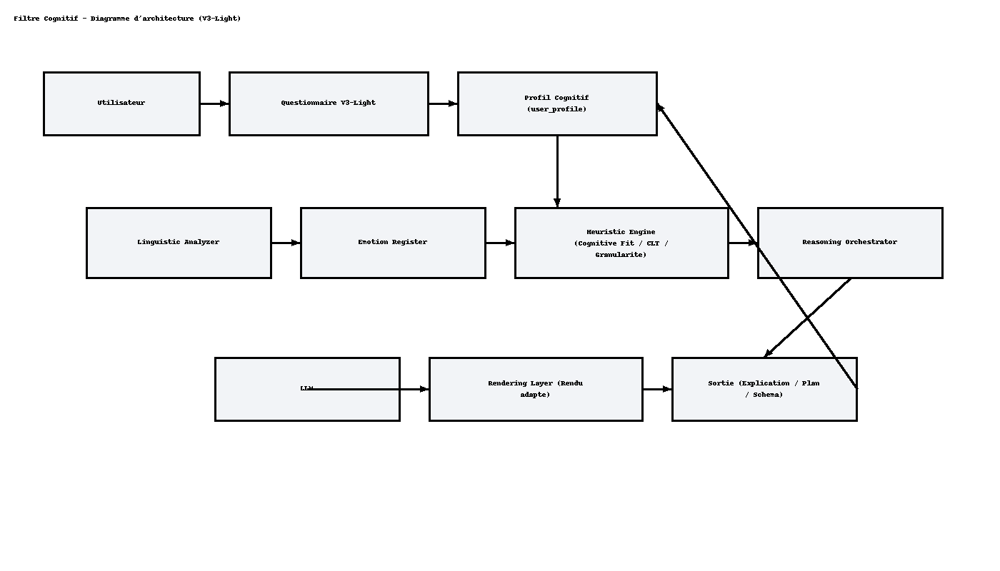

# Filtre Cognitif — Master Dev Pack (V3-Light)

**⚠️ Document confidentiel – Usage interne uniquement**  
Toute reproduction, diffusion ou réutilisation partielle ou totale de ce document sans autorisation expresse de **Damien Chéret** est strictement interdite.  
**Projet : Filtre Cognitif (v3-Light / Déterminisme Réversible)**  
**Date : 2025-10-22**

---

## 1. Introduction & Vision
[...] (version longue incluse dans le pack précédent ; ce document fait foi)
Voir également la spécification: `Documentation/FiltreCognitif_SpecDev_v2_5_DamienCheret.pdf`.

## 2. Architecture générale
Flux : Utilisateur → Questionnaire (V3-Light) → user_profile → Orchestrateur → LLM → Rendu adapté → Feedback

## 3. Structure du dossier
(voir arborescence fournie)

## 4. Fonctionnement du filtre cognitif
(lecture cognitive → heuristiques → orchestration → rendu → feedback)

## 5. API, mapping, parsing
Endpoints: `/profile/parse`, `/hints/compute`. Mapping: `Donnees_Cognitives/mapping_v3_light.json`

## 6. Roadmap & livrables
S1: parsing ; S2: heuristiques ; S3: rendu + LLM ; S4: observabilité/RGPD.

## 7. Checklist de validation
Mapping chargé, parse correct, hints conformes, rendu aligné, traçabilité, confidentialité, métriques.

## 8. Sécurité & maintenance
PII minimale, environnements séparés, versioning du mapping, évolutivité.

## Annexe

